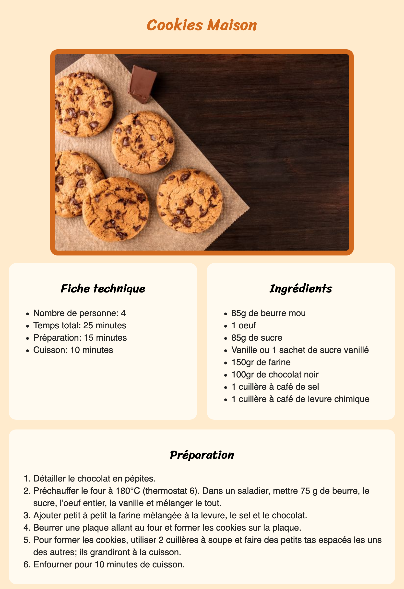

# Votre première page HTML & CSS - Votre recette de cuisine préférée

## Énoncé

Vous avez bien lu, on va vous demander de réaliser une première page HTML sans avoir vu de théorie au préalable. Le but c'est d'explorer par vous même les ressources mise à votre disposition et à expérimenter.

Vous allez devoir réaliser une one-page qui présente votre recette de cuisine préférée! 
Basez vous sur le dossier exercice-recette comme base à la création de votre première recette, vous y trouverez un fichier style.css déjà lié au fichier index.html et un fichier index.html rempli du squelette de base et des méta-données.

## Objectifs

* Le nom de votre recette doit être **un titre HTML**
* La page doit contenir **une image** de votre recette
* Il doit y avoir plusieurs **listes:**
  * Une liste **non ordonnée** contenant les ingrédients
  * Une liste **non ordonnée** différente avec les informations pratiques (temps de cuisson, nombre de personne,...)
  * Une liste **ordonnée** avec les étapes de préparation **OU** plusieurs **paragraphes**

## Compétences acquises au terme de l'exercice

* Suivre une liste d'objectifs
* Apprendre à se débrouiller
* Apprendre quelques bases d'HTML et CSS

## Tips / Astuces 

* Retournez lire la théorie vue plus tôt
* Pourquoi ne pas essayer d'insérer une Google Font?
* Si vraiment vous voulez aller plus loin, vous pouvez essayer une mise en page avec Flexbox

## Le mot du formateur

Cet exercice peut sembler impossible si tu n'as aucune base d'HTML ou CSS, mais ne vous en faites pas, le but ici c'est d'essayer d'allez le plus loin possible et d'apprendre à chercher par soi même. On verra, les prochaines semaine, ce qui est demandé dans cet exercice et bien plus.

**Bon travail!**

